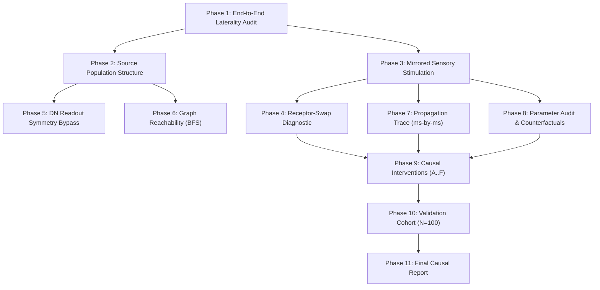

# Steering Asymmetry & Motor-Circuit Causal Mapping — Experiment Plan

## 1. Context & Motivation

Phase IV-C Development V2 exposed a decisive substrate asymmetry in the fruit fly whole-CNS connectome:
- Mirror-left turn: `turn_left` raw rate = 0.387 Hz, candidate activation = 0.227
- Mirror-right turn: `turn_right` raw rate = 0.000 Hz, candidate activation = 0.000

The entity did not deliberate and reject a right turn; the neural substrate never produced a viable right-steering candidate.

This research lane systematically isolates the causal locus of this asymmetry across the full anatomical and dynamical pipeline:
$$\text{Sensory Input} \longrightarrow \text{Receptor Populations} \longrightarrow \text{Connectome Topology} \longrightarrow \text{Recurrent Dynamics} \longrightarrow \text{Descending Neurons} \longrightarrow \text{Candidate Readout}$$

---

## 2. Research Hypothesis & Candidate Explanations

We test eight mutually non-exclusive hypotheses:

1. **H1: Implementation Laterality Error**: Sign inversions, misnamed left/right variables, indexing collisions, or asymmetric readout math.
2. **H2: Readout Distortion (READOUT_C)**: Differential steering formula $1 - \exp(-\Delta / \tau)$ fails to mirror-map symmetric inputs.
3. **H3: Receptor Afferent Disparity**: Anatomical receptor count imbalance in sensory afferents (e.g. tactile T1 left vs right).
4. **H4: Structural Disconnection**: Directed synaptic paths from right sensors to right steering DNs do not exist in the source graph.
5. **H5: RateNetwork Parameter Bias**: Seeded dynamical parameters (gain $a_i$, threshold $\theta_i$, time constant $\tau_i$, $r_{\max,i}$) systematically bias activation toward the left hemisphere.
6. **H6: Recurrent Dynamic Suppression**: Synaptic paths exist, but recurrent inhibition or contralateral cross-inhibition suppresses right steering pathways specifically under mechanosensory drive.
7. **H7: Modality-Specific Routing**: Deficit is restricted to specific sensory modalities (e.g. mechanosensory tactile) while other modalities (thermosensory, wind) engage bilateral steering circuits symmetrically.
8. **H8: Biological Asymmetry in Upstream Fly**: The biological connectome itself possesses intrinsic bilateral asymmetry in steering descending inputs (as documented in upstream `motor.js` lines 79–81).

---

## 3. Experimental Protocol

### Phase 1: Laterality & Coordinate Audit
- Automated scan of all 165,122 neurons in `neurons.bin` ($1=\text{Left}$, $2=\text{Right}$, $3=\text{Midline}$, $0=\text{Unknown}$).
- Verification of 1-to-1 disjoint index mapping for steering descending neurons (`DNa02`, `DNa01`, `DNp09`).
- Audit of sensory group counts in `bodymap.json`.
- Algebraic and numerical verification of `candidate_readouts.mjs`.

### Phase 2: Source Connectome Structural Audit
- Exact neuron IDs, indices, in-degree, out-degree, total weighted incoming synapses, and neurotransmitter composition.
- Cross-hemispheric synaptic decomposition: input edges from left ($s=1$), right ($s=2$), and midline ($s=3$) sources.

### Phase 3: Mirrored Direct Sensory Stimulation
- Harness: Standalone 60 ms `SensoryAtlasHarness` trials (10 ms baseline, 25 ms stimulus, 25 ms post).
- Modalities: `tactile T1`, `JO wind/gravity`, `thermosensory`, `taste T1`.
- Intensities: 10, 30, 60, 100, 140, 180 Hz.
- Diagnostic Seeds: $15000..15009$ ($N=10$).
- Metric: Mirror Ratio $R = \frac{\text{turn\_right}(\text{stim}_R)}{\text{turn\_left}(\text{stim}_L)}$.

### Phase 4: Receptor-Swap Diagnostic
- Condition 1: Normal Left (Physical L drive $\to$ Left Receptors).
- Condition 2: Normal Right (Physical R drive $\to$ Right Receptors).
- Condition 3: Swapped Left $\to$ Right (Physical L drive $\to$ Right Receptors).
- Condition 4: Swapped Right $\to$ Left (Physical R drive $\to$ Left Receptors).
- Condition 5: Equalized count (first 115 Left receptors vs 115 Right receptors).

### Phase 5: Descending Readout Symmetry Bypass
- Direct injection of synthetic DN firing rates $[0.1, 0.25, 0.5, 1.0, 2.0, 5.0]\text{ Hz}$ bypassing connectome.
- Formulations tested: `READOUT_A_CURRENT`, `READOUT_B_UPSTREAM`, `READOUT_C_INDEPENDENT_AXES`.
- Symmetry Error metric: $|\text{Left}(A) - \text{Right}(B)| + |\text{Right}(A) - \text{Left}(B)|$.

### Phase 6: Graph Reachability Analysis
- Forward BFS traversal from sensory receptors over full $10.5\text{M}$ CSR graph.
- Up to depth 4 hops.
- Target detection: Minimum hop count and cumulative synaptic weight to `DNa02`, `DNa01`, `DNp09`.
- Classification: **STRUCTURALLY ABSENT** vs **STRUCTURALLY PRESENT BUT DYNAMICALLY SILENT**.

### Phase 7: Temporal & Spatial Propagation Trace
- Millisecond-by-millisecond capture of 165,122 neuron firing rates.
- Activity tracking in concentric layers: $t_0$ (receptors), $t_1$ (1-hop interneurons), $t_2$ (2-hop premotor interneurons), $t_3$ (DNs).
- Divergence detection: Earliest time step and anatomical layer where mirror responses diverge.
- Population ranking: Top 20 cell types ranked by absolute firing rate divergence.

### Phase 8: Rate-Network Parameter Audit
- Extraction of $a_i, \theta_i, \tau_i, r_{\max,i}, s_i$ for left vs right homologues.
- Counterfactual parameter cloning: copy left steering DN parameters directly into right homologues.
- Re-run Right tactile stimulation: check if parameter equalization restores right steering.

### Phase 9: Causal Interventions
- Branch A: Intact baseline.
- Branch B: Silence dominant contralateral left steering DNs (`130496, 406, 725`).
- Branch C: Sham silencing of unrelated descending neurons (MDN).
- Branch D: Direct excitatory drive to right DNa02 (`332`).
- Branch E: Energy equalization (boost right receptor stimulus by $151/115 = +31.3\%$).
- Branch F: Receptor swap.

### Phase 10: Validation Cohort
- Frozen hypothesis tested against fresh seeds $16000..16099$ ($N=100$).
- Report: effect direction, magnitude, variance, response latency, replication fraction.

---

## 4. Execution Rules & Boundaries
- Strictly read-only on Phase IV-C branches and artifacts.
- Seeds $12000..12099$ strictly untouched.
- Diagnostic seeds: $15000..15049$.
- Validation seeds: $16000..16099$.
- No synaptic weight modification (no plasticity).
- No maze navigation or DeltaX performance scoring.
